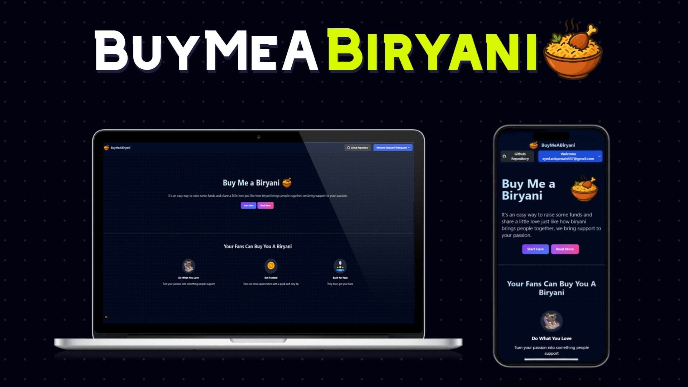

# 🍛 Buy Me a Biryani

A creator support platform for Pakistan 🇵🇰 — let fans tip you easily, just like Patreon but with local vibes and a dash of biryani.



---

## ✨ Features

- 🔐 Email & password login using **NextAuth (Credentials Provider)**
- 🧂 Passwords securely hashed with **bcrypt**
- 📦 Data stored in **MongoDB** via **Mongoose**
- 🎨 Responsive UI with **Tailwind CSS**
- 🧑‍🎨 Customizable profiles (bio, profile pic, banner)
- 🚫 Custom glitchy **404 page**
- 🔒 Secure backend structure

---

## 🧰 Tech Stack

- **Next.js** (App Router)
- **Tailwind CSS**
- **MongoDB + Mongoose**
- **NextAuth + bcrypt**
- **Vercel Hosting**

---

## 🧪 Run Locally

```bash
git clone https://github.com/ZulqarnainX/BuyMeABiryani.git
cd buymeabiryani
npm install

# Setup environment
cp .env.example .env.local
# Fill in your MongoDB URI, NEXTAUTH_SECRET, etc.

npm run dev
````

Visit : https://buy-me-a-biryani.vercel.app/

